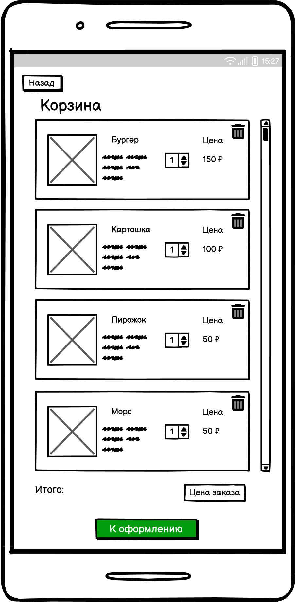
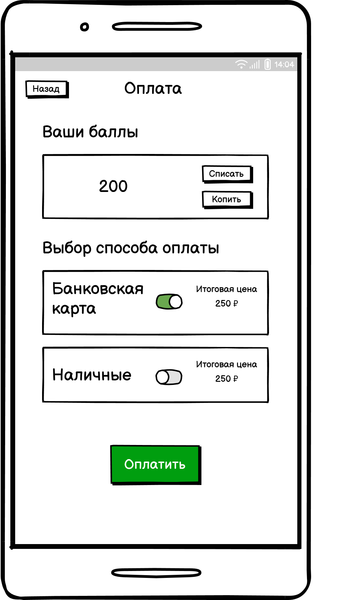

# 10 Задачи для разработки

## 10.1 Задачи для разработки реализуемые в рамках MVP

### 1. UC - 1 - Ознакомится с меню

Просмотр меню с возможностью добавления блюд в корзину

**Дизайн**

**Запрос и функции**

HTTP-запрос: GET/menu

|**№**|**Поля**|
|----|------------------------------------|
|1|Название блюда|
|2|Описание блюда|
|3|Ссылка на картинку блюда|
|4|Категория|
|5|Ингредиенты|
|6|Цена|

|**№**|**Функции**|
|----|------------------------------------|
|1|Открытие главной страницы с меню|

### 2. UC - 2-3 - Сформировать корзину

Формирование корзины путем изменения количества блюд

**Дизайн**

**Запрос и функции**

|**№**|**Поля**|
|----|------------------------------------|
|1|Названия блюда|
|2|Цена блюда|
|3|Количество выбранных блюд|
|4|Общая цена (Итого)|

|**№**|**Функции**|
|----|------------------------------------|
|1|Обновление изменения количества позиций при нажатии кнопок "+" и "-"|
|2|Обновление суммы "Итого" при изменении количества блюд|
|3|Проверка, что выбранное количество больше нуля, для активации кнопки "К оформлению"|
|4|
Обработка нажатия на кнопку "Назад"

|

### 3. UC - 4 - Выбор способа получения

Информация о способе выдачи заказа “в зале”/”на вынос”

**Дизайн**

**Запрос и функции**

Выбор способа употребления пищи в приложении
HTTP-запрос: PATCH/order/{orderId}

|**№**|**Функции**|
|----|------------------------------------|
|1|Обработка нажатия на кнопку "На вынос"|
|2|Обработка нажатия на кнопку "В зале"|
|3|Обработка нажатия на кнопку "Назад"|

### 4. UC - 5 - Зарегистрироваться в системе

Регистрация пользователя в программе лояльности

**Дизайн**

**Запрос и функции**

|**№**|**Функции**|
|----|------------------------------------|
|1|Проверка, что посетитель не авторизован для отображения страницы выбора регистрации/авторизации пользователя|
|2|Обработка нажатия на кнопку "Авторизация/Регистрация"|

HTTP-запрос: POST/users/check

|**№**|**Поля**|
|----|------------------------------------|
|1|Телефон|

|**№**|**Функции**|
|----|------------------------------------|
|1|Обработка нажатия на кнопку "Авторизация/Регистрация"|
|2|Обработка нажатия на кнопку "Назад"|
|3|Обработка нажатия на кнопку “Отказаться” - переводить на шаг с выбором оплаты|

HTTP-запрос: POST/users/registration

|**№**|**Поля**|
|----|------------------------------------|
|1|Имя|
|2|Телефон|
|3|E-mail|

|**№**|**Функции**|
|----|------------------------------------|
|1|Обработка нажатия на кнопку "Продолжить"|
|2|Подсвечивание полей с ошибками: Email и номер должны быть в правильном формате|
|3|Проверка на уникальность Email и номера телефона|
|4|Подсвечивание обязательных полей на заполнение|
|5|Обработка нажатия на кнопку "Назад"|

|**№**|**Поля**|
|----|------------------------------------|
|1|Поле ввода кода подтверждения|
|2|Поле телефона указанного в форме регистрации пользователя |

|**№**|**Функции**|
|----|------------------------------------|
|1|Обработка нажатия на кнопку "Повторно отправить СМС"|
|2|Обработка после ввода значения в поле СМС|
|3|Сообщение об успешной регистрации или ошибке ввода СМС|
|4|Обработка нажатия на кнопку "Назад"|

### 5. UC - 6 - Авторизоваться в системе

Авторизация пользователя в программе лояльности

**Дизайн**

**Запрос и функции**

HTTP-запрос: POST/users/login

|**№**|**Поля**|
|----|------------------------------------|
|1|Телефон|

|**№**|**Функции**|
|----|------------------------------------|
|1|Обработка нажатия на кнопку "Продолжить"|
|2|Обработка нажатия на кнопку "Назад"|

HTTP-запрос: POST/users/sms-code

|**№**|**Поля**|
|----|------------------------------------|
|1|Поле ввода кода подтверждения|
|2|Поле телефона указанного в форме регистрации пользователя |

|**№**|**Функции**|
|----|------------------------------------|
|1|Обработка нажатия на кнопку "Повторно отправить СМС"|
|2|Обработка после ввода значения в поле СМС|
|3|Сообщение об успешной регистрации или ошибке ввода СМС|
|4|Обработка нажатия на кнопку "Назад"|

### 6. UC - 7 - Начислить баллы по программе лояльности

Получить баллы по программе лояльности после оформления и оплаты заказа

**Дизайн**

**Запрос и функции**

Получить баллы по программе лояльности после оформления и оплаты заказа
HTTP-запрос: GET/bonus

|**№**|**Поля**|
|----|------------------------------------|
|1|Количество баллов на счете|

|**№**|**Функции**|
|----|------------------------------------|
|1|Обработка нажатия на кнопку "Копить"|

### 7. UC - 8 - Списать баллы по программе лояльности

Получить баллы по программе лояльности после оформления и оплаты заказа

**Дизайн**

**Запрос и функции**

Получить баллы по программе лояльности после оформления и оплаты заказа
HTTP-запрос: GET/bonus

|**№**|**Поля**|
|----|------------------------------------|
|1|Количество баллов на счете|

|**№**|**Функции**|
|----|------------------------------------|
|1|Обработка нажатия на кнопку "Списать"|

### 8. UC - 9 - Произвести оплату картой

Оплата оформленного заказа картой

**Дизайн**

**Запрос и функции**

HTTP-запрос: POST/orders/payment
HTTP-запрос: POST/payment-status

|**№**|**Поля**|
|----|------------------------------------|
|1|Названия блюда|
|2|Цена блюда|
|3|Количество выбранных блюд|
|4|Общая цена (Итого)|
|5|Заказ (С собой/В зале)|

|**№**|**Функции**|
|----|------------------------------------|
|1|Обработка нажатия на кнопку "Оплатить заказ"|
|2|Обработка нажатия на кнопку "Заказ: на вынос/в зале"|
|3|Обработка нажатия на кнопку "Назад"|

HTTP-запрос: GET/order/{orderId}

|**№**|**Поля**|
|----|------------------------------------|
|1|Номер заказа|
|2|Дата-время приготовления блюд|

### 9. UC - 10 - Получить информацию о готовности заказа по СМС

Получение информации о готовности заказа посредством СМС сообщения

**Запрос и функции**

|**№**|**Функции**|
|----|------------------------------------|
|1|Отправка СМС сообщения при смене статуса заказа на Готово|

### 10. UC - 11 - Получить информацию о готовности заказа на информационном табло

Получение информации о готовности заказа на информационном табло

**Дизайн**

**Запрос и функции**

Получение информации о готовности заказа на информационном табло
HTTP-запрос: GET/orders/{orderId}/status

|**№**|**Поля**|
|----|------------------------------------|
|1|Готовятся|
|2|Готовы|

|**№**|**Функции**|
|----|------------------------------------|
|1|Отображение статуса на информационном табло|
|2|Отображение о сбоях технологических процессов в интерфейсе менеджера по гостеприимству|

### 11. UC - 12 - Проверить наличие ингредиентов на производстве

Проверка наличия ингредиентов на производстве в ходе оформления заказа

**Дизайн**

**Запрос и функции**

Проверка наличия ингредиентов на производстве в ходе оформления заказа
HTTP-запрос:POST/cart/checkout

|**№**|**Функции**|
|----|------------------------------------|
|1|Обработка нажатия на кнопку "К оформлению"|
|2|Проверка количества ингредиентов на складе для приготовления блюда, в случае отсутствия комплектация и проверка альтернативных блюд|

|**№**|**Поля**|
|----|------------------------------------|
|1|Названия отсутствующего блюда|
|2|Названия блюда на замену|
|3|Изображение блюда на замену|
|4|Цена каждого блюда на замену|

|**№**|**Функции**|
|----|------------------------------------|
|1|Добавление блюда на замену в корзину при нажатии на блюдо|
|2|Обработка добавления или отказа|
|3|Обработка нажатия на кнопку "Назад"|

