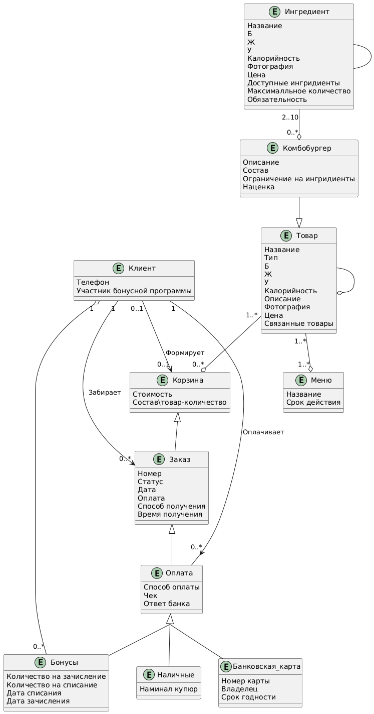
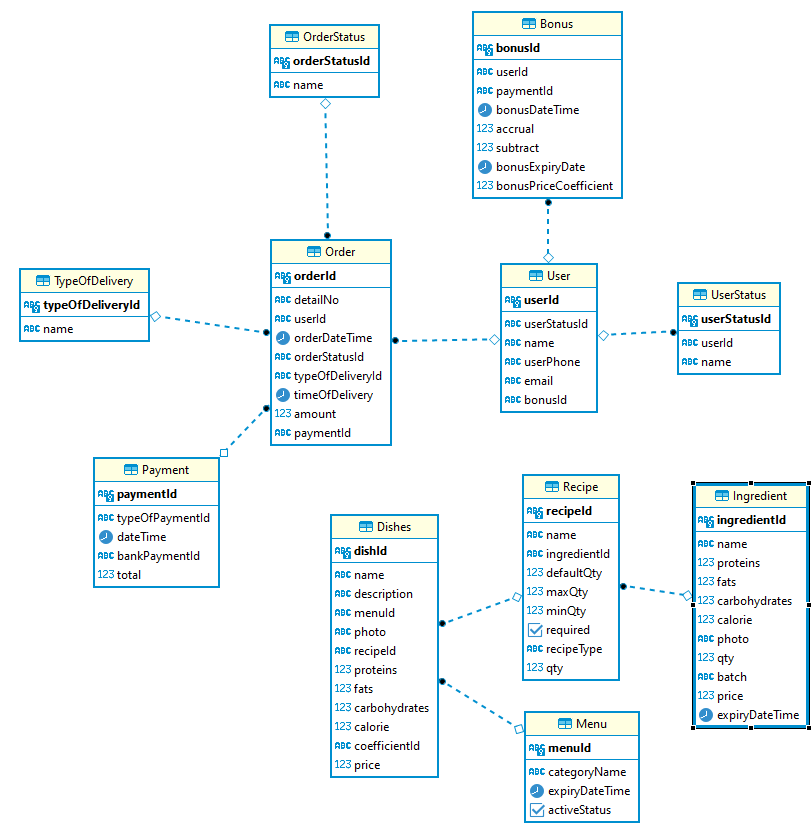

# 6. Информационная модель
## 6.1 Модель предметной области
В рамках MVP проекта были выделены основные сущности с атрибутами и определены связи между ними.

Базовыми сущностями являются:

- Пользователь
- Заказ
- Блюдо
- Ингредиент

[ClassDiagram](UML/Диаграмма_классов.wsd)

## 6.2 Модель данных
[Postgresql](База_данных/База_данных_MakBot.sql)

