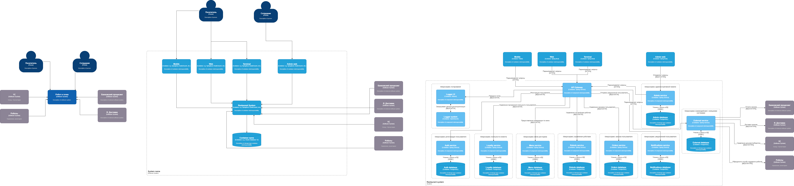

# 7. Компонентная архитектура

## 7.1 Обоснование выбора архитектурного стиля

Микросервисная архитектура представляет собой эффективный метод разработки приложений, которым требуется способность к масштабированию и гибкость в адаптации. В контексте приложения для заказа еды в ресторане, данная архитектура предоставляет ряд преимуществ:

**Гибкость:** Микросервисы могут разрабатываться и разворачиваться независимо друг от друга, что позволяет вносить изменения в приложение оперативно, без необходимости перезапускать его целиком.

**Масштабируемость:** Каждый микросервис можно масштабировать отдельно, что упрощает управление нагрузкой на приложение и обеспечивает его высокую доступность.

**Устойчивость:** В случае сбоя одного из микросервисов остальные могут продолжать функционировать, что повышает общую устойчивость приложения.

**Простота разработки:** Разработчики могут сосредоточиться на создании отдельных микросервисов, что упрощает процесс разработки и тестирования.

**Упрощение внедрения новых функций:** Новые возможности могут быть интегрированы через создание новых микросервисов, что позволяет быстро добавлять новые функциональности в приложение.

## 7.2 Диаграмма компонентов

На диаграмме представлены компоненты микросервисной архитектуры системы и интеграции между данными компонентами.

[ViewerDiagrams](Диаграмма компонентов/Диаграмма компонентов.drawio) 
 

## 7.3 Описание компонентов

|**№ п/п**|**Тип**|**Наименование**|**Технологии**|**Описание**|
|----|------------------------------------|--------------------------------------|------------------------------------------------------|----------------|
|1|Container|Mobile|Flutter|Взаимодействие между пользователями и приложением через мобильное приложение|
|2|Container|Web|Spring Boot|Взаимодействие между клиентами, пользователями и приложением через веб-сайты|
|3|Container|Terminal|Spring Boot|Взаимодействие между пользователями и приложением через терминал|
|4|Container|Logger UI|Kibana|Визуализация данных OpenSearch|
|5|Container|Logger system|OpenSearch|Управление логированием и хранение логов|
|6|Container|API Gateway|Spring Service|Обеспечивает взаимодействие с внутренними системами|
|7|Container|Auth service|Spring Service|Регистрация и авторизация пользователя|
|8|Container|Auth database|PostgreSQL|Хранение данных регистрации клиентов|
|9|Container|Loyalty service|Spring Service|Управление программой лояльности пользователя: начисление, списание баллов|
|10|Container|Loyalty database|PostgreSQL|Хранение данных по программе лояльности пользователей: количество начисленных, списанных баллов и общее количество за всё время|
|11|Container|Menu service|Spring Service|Управление составом меню: добавление, удаление, редактирование информации, а также отображение меню для пользователя|
|12|Container|Menu database|PostgreSQL|Хранение данных по составу меню|
|13|Container|Robots service|Spring Service|Управление настройками роботов: добавление, удаление, редактирование информации|
|14|Container|Robots database|PostgreSQL|Хранение данных по настройкам роботов|
|15|Container|Orders service|Spring Service|Управление заказами пользователя: добавление, удаление позиций, а также выбор способа получения и выдача номеров заказов|
|16|Container|Orders database|PostgreSQL|Хранение данных о заказах|
|17|Container|Notifications service|Spring Service|Управление уведомлениями для пользователя|
|18|Container|Notifications database|PostgreSQL|Хранение данных об уведомлениях|
|19|Container|Admin Web|Spring Boot|Взаимодействие между администраторами и приложением через веб-сайты|
|20|Container|Admin service|Spring Service|Административная панель для управления составом меню, настройками роботов|
|21|Container|Admin database|PostgreSQL|Хранение данных о ролевой модели администраторов|
|22|Container|External service|Spring Service|Обеспечивает взаимодействие с внешними системами|
|23|Container|External database|PostgreSQL|Хранение информации из внешних систем|
|24|External system|Банковский процесинг|Software System|Управление оплатой через банковский сервис|
|25|External system|Я. Доставка|Software System|Управление доставкой еды из ресторанов|
|26|External system|1С|Software System|Управление внутренним документооборотом ресторана|
|27|External system|Роботы|Software System|Управление заводскими настройками роботов|

